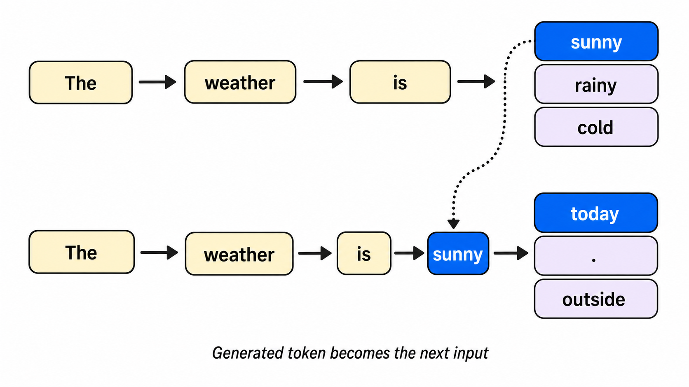

# 第 1 部分 · AI 大模型

### 先用一句话理解

当下环境中，大模型更多指的是大语言模型 LLM (Large Language Model)。

你给它一段输入，它会根据**上下文(context)**逐个选择最可能出现的词，逐个拼接，最终得到看起来正确的结果。



图中蓝色词是模型当前生成的结果。它被追加到上下文里之后，就会成为下一步预测的输入。

### 为什么叫“大模型”

“大”主要指它在训练时使用了大量数据和大量参数。一般情况下，参数量越大，模型能力越强。

**大模型不适合所有任务**。

从刚刚的图可以看出，大模型所有的输出都是根据模型参数逐个生成的。所以事实在模型里也会变成概率预测，你永远不能保证它的结果一定正确可靠。

有时小模型更便宜、更快；复杂任务才需要更强模型。联网查资料、读文件、调用外部工具这些步骤，应该交给确定性的工具来做；有可靠来源时，不能盲目依赖模型自己生成。

## 它能做什么、不能做什么

### 它擅长做什么

大模型最擅长处理 **信息** 和 **表达**。

你可以从一个任务的生命周期理解它的作用。刚开始时，你可能只有一个模糊想法，比如“我想学 AI”或“我想写一篇文章”。这时大模型适合帮你把想法展开成提纲。接着你有了材料，比如文章、会议记录、课程笔记，它适合帮你读出重点。等你有了草稿，它又适合帮你改写、压缩、换语气、检查逻辑。

它最有价值的地方，是**把你从空白页带到第一版，再把第一版改得更清楚**。解释概念、总结材料、生成草稿、拆解计划、辅助写代码，都可以放进这个过程里理解。

### 它不擅长什么

理解了它擅长“生成和组织”，就更容易理解它不擅长什么。

第一类是**不稳定事实**，比如最新政策、价格、版本和活动。模型可能没有最新信息，即使语气很确定，也可能只是根据旧知识补出来。

第二类是**高风险决策**，比如法律、医疗、投资。AI 可以帮你理解材料，但最终责任不能交给它。

第三类是**敏感信息**，比如密码、验证码、`API Key`、证件和合同。它们一旦进入外部系统，风险就不再只由你本地控制。

例如你问：

```text
某个软件现在最便宜的套餐多少钱？
```

如果没有联网或来源，它可能给出过期答案。

更稳妥的问法是：

```text
请联网查找这个软件当前官方价格，并给出来源链接。
如果不同地区价格不同，请说明。
```

### 为什么它会说错

大模型是根据上下文逐步生成 token 的，不会默认把每句话都拿去事实数据库核对。它擅长生成流畅、像正确答案的文字，但事实本身可能没有被验证。

常见出错原因有三种：你给的信息不完整，它会补全；问题有歧义，它会选最常见的解释；事实已经变化，它仍按旧知识回答。

这些猜测一旦被组织成流畅文字，就会形成 **幻觉**：看起来合理、自信，但内容可能不真实。判断 AI 回答时，不要只看语气和格式，要看来源、边界，以及是否和已知事实冲突。

### 如何降低出错概率

核心思想是：“种瓜得瓜，种豆得豆。”

AI 不是万能的许愿机，你给出的信息和指示越充分清晰，得到的结果也就越好。笔者一般称为 “quality in, quality out”。

1. 先减少它猜测的空间，给足背景和材料；

2. 要求它区分确定和不确定。如果涉及事实，就要求来源；如果任务复杂，就让它先复述理解，再开始回答。

可以这样写：

```text
如果你不确定，请直接说不确定，不要猜。
请把确定的信息和需要核查的信息分开列出。
```

3. 涉及事实时，再加来源要求：

```text
请给出来源链接，并说明每个来源支持了哪条结论。
```

4. 涉及复杂任务时，先让它确认任务：

```text
请先列出你理解的任务目标、已知信息和缺失信息。
如果信息不足，请先问我问题。
```

### 使用原则

2026 年 7 月 1 日。在整理这份教程的过程中，笔者也总结了一些 AI 使用经验。

使用时的核心观念是：

> 1. 你知道如何对 AI 生成结果进行评价 (harness)
> 2. 你知道如何提升 AI 生成的内容 (loop)
> 3. 你知道你想要什么样的生成结果 (goal)

上述三条不一定全部满足。面对复杂任务时，我们通常先明确其中一个，再通过迭代逐步补齐。

AI 的上限取决于使用者的上限。

## 常用模型速览

本章会并列介绍 `Claude`、`ChatGPT`、`Kimi` 和 `DeepSeek` 的定位、入口和典型使用场景。

[ChatGPT](https://chatgpt.com/) / [Claude](https://claude.ai/) / [Kimi](https://www.kimi.com/) / [DeepSeek](https://chat.deepseek.com/)
